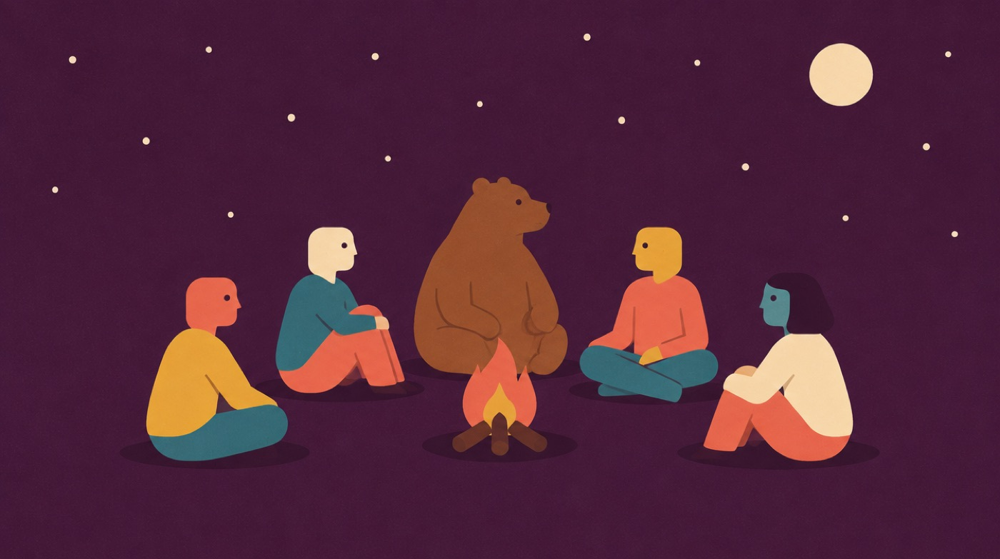

# Hoffman house illustration style — the reference library

**Twelve worked examples, each with the exact prompt that made it.** Copy the
style prefix, append a subject line, paste into any image AI. That is the whole
method.

The rule and the workflow live in [`IMAGERY.md`](../../IMAGERY.md); this folder
is the evidence that the prompt works and the shortcut when you just want to
start.

## Where the style comes from

The look is Hoffman's own editorial illustration, as used across
[storytelling.hoffman.com](https://storytelling.hoffman.com) and the
*Great Myth of Storytelling in Business Communications* paper: flat vector,
paper-grain texture, a small warm palette, and simplified figures with dot eyes
and an angular nose in profile. It sits in the mid-century editorial tradition —
conceptual, calm, a bit dry, never cute and never corporate-clipart.

## The style prefix — copy this

> Flat vector editorial illustration with a subtle paper-grain, gouache-textured finish. Warm muted editorial palette: coral-salmon red, petrol teal-blue, mustard golden-yellow, cream off-white, plum purple, and muted slate-blue and grey. Stylised human characters with simple rounded or elongated heads, small round dot eyes, a prominent angular nose in profile, thin minimal limbs, flat solid-colour clothing, warm terracotta skin tones. One clear conceptual metaphor, generous negative space, a flat single-colour textured background, soft small drop shadows. Whimsical, intelligent, calm, dry-witted business-editorial mood. Absolutely no text, letters, numbers, words, logos, watermark, or signature.

Then add one line describing the subject. Every example below shows exactly that.

## Aspect and size

16:9 for slides. See `AGENTS.md` Section 4 for the full aspect-to-resolution
table before you generate anything for a deck.

---

### The myth / the thing everyone reveres

**Use it for:** the myth / the thing everyone reveres.

**Subject line** (append to the style prefix above):

> SUBJECT: two tiny figures stand on a blue mountain peak looking up at a very large coral-salmon monolithic head in profile, like a stone idol.

### The audience / who is actually listening

**Use it for:** the audience / who is actually listening.

**Subject line** (append to the style prefix above):

> SUBJECT: a small group sit in a circle around a campfire at night, with a calm bear sitting among them as if listening; small cream moon and scattered stars.

### Finding the story / research

**Use it for:** finding the story / research.

**Subject line** (append to the style prefix above):

> SUBJECT: one figure in a white coat stands among a large field of overlapping flat circles in greys and teals, holding up the single bright mustard circle they have just found.

### The proof / the number that lands

**Use it for:** the proof / the number that lands.

**Subject line** (append to the style prefix above):

> SUBJECT: two figures stand either side of an oversized flat bar chart, one bar dramatically taller, one figure gesturing towards it.

### The choice / the fork

**Use it for:** the choice / the fork.

**Subject line** (append to the style prefix above):

> SUBJECT: one figure stands where a single path splits into two very different roads, one curving up into hills and one running flat into the distance.

### Signal in the noise

**Use it for:** signal in the noise.

**Subject line** (append to the style prefix above):

> SUBJECT: a dense field of small grey scribbles fills the frame, and one figure holds up a single clean bright coral shape pulled out of it.

### Complexity out, clarity in

**Use it for:** complexity out, clarity in.

**Subject line** (append to the style prefix above):

> SUBJECT: a tangled knot of looping lines on the left resolves left-to-right into one clean straight line, a small figure walking alongside.

### Partnership / the handshake

**Use it for:** partnership / the handshake.

**Subject line** (append to the style prefix above):

> SUBJECT: two figures shake hands across a gap between two separate platforms, the handshake forming the bridge.

### The obstacle before the breakthrough

**Use it for:** the obstacle before the breakthrough.

**Subject line** (append to the style prefix above):

> SUBJECT: a small figure pushes a large plain boulder up a gentle slope, a flat sun-like circle waiting over the crest.

### Reach and distribution

**Use it for:** reach and distribution.

**Subject line** (append to the style prefix above):

> SUBJECT: one figure speaks into a large simple broadcast horn, flat concentric arcs rippling outward to several tiny distant figures.

### Time / the long game

**Use it for:** time / the long game.

**Subject line** (append to the style prefix above):

> SUBJECT: an oversized flat hourglass dominates the frame, sand part-run-through, a small calm figure sitting on its base reading.

### The detail that matters

**Use it for:** the detail that matters.

**Subject line** (append to the style prefix above):

> SUBJECT: a figure holds a large simple magnifying glass over a small flat object; through the lens it appears far larger and brighter coral.

---

## The three legacy samples

`iceberg.jpg`, `robot-handoff.jpg` and `toolbox-choice.jpg` are the original
2026 reference images. They are the same family but an earlier, more detailed
take. Their suits are fine — these are caricatures, and business-casual is the
house lean rather than a rule. Treat the twelve examples above as the current
reference; keep the legacy three for lineage.

---

The Hoffman Agency design system — created by **Nicolas Chan**, Head of Digital &amp; Chief Strategist, AMEA. [neekchan@gmail.com](mailto:neekchan@gmail.com) · [nchan@hoffman.com](mailto:nchan@hoffman.com) · [linkedin.com/in/nicolaschan](https://www.linkedin.com/in/nicolaschan/)
